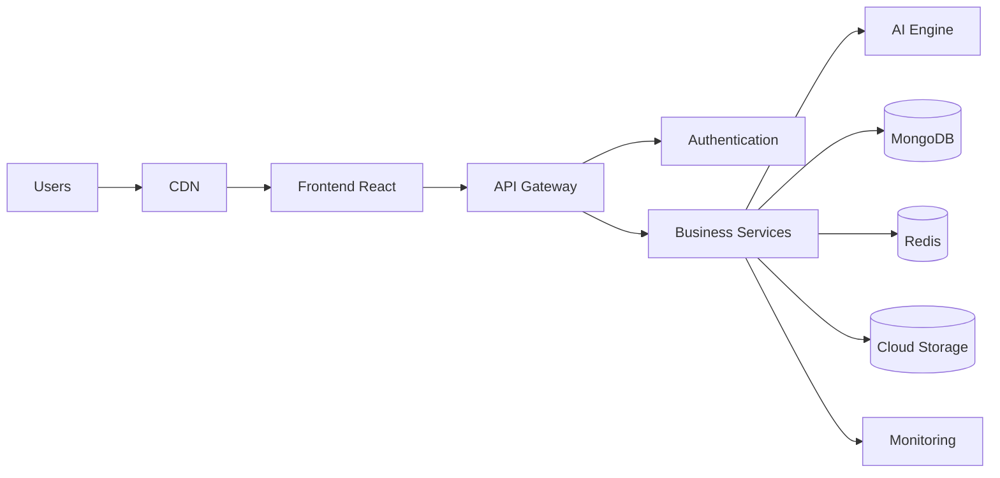
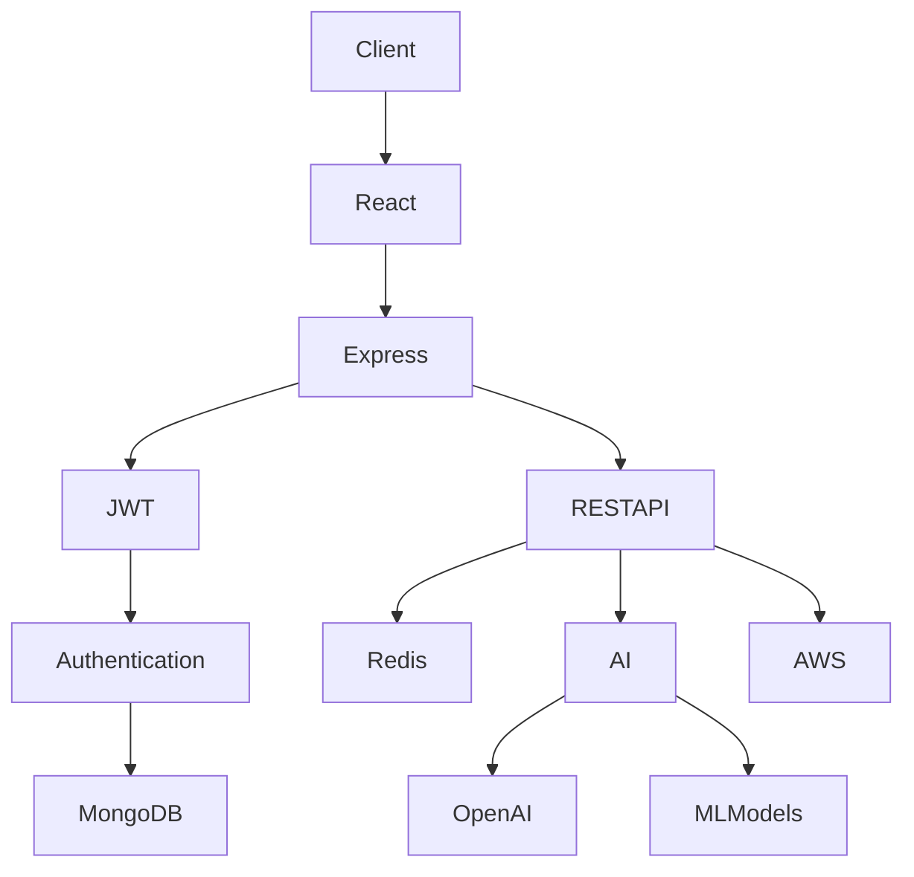
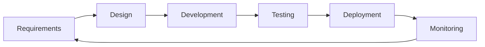

<!-- ========================================================= -->
<!--                     GITHUB PROFILE README                  -->
<!-- ========================================================= -->

<h1 align="center">
  Hi 👋, I'm Edwin Mwangi
</h1>

<h3 align="center">
Full Stack Software Engineer • AI Developer • Backend Architect • Problem Solver
</h3>

<p align="center">
  
</p>

<p align="center">


</p>

---

# 👨‍💻 About Me

```python
class EdwinMwangi:

    def __init__(self):
        self.name = "Edwin Mwangi"
        self.location = "Nairobi, Kenya"

        self.role = "Full Stack Software Engineer"

        self.languages = [
            "Python",
            "JavaScript",
            "TypeScript",
            "Java",
            "SQL"
        ]

        self.backend = [
            "Node.js",
            "Express",
            "Django",
            "REST APIs"
        ]

        self.frontend = [
            "React",
            "Next.js",
            "Tailwind CSS",
            "HTML",
            "CSS"
        ]

        self.databases = [
            "MongoDB",
            "MySQL",
            "PostgreSQL",
            "Firebase"
        ]

        self.cloud = [
            "AWS",
            "Docker",
            "GitHub Actions"
        ]

        self.interests = [
            "Artificial Intelligence",
            "Machine Learning",
            "System Design",
            "Cloud Computing",
            "Automation"
        ]

    def motto(self):
        return "Build software that people actually enjoy using."

me = EdwinMwangi()
```

---

# 🚀 What I Do

- 💻 Design and develop full-stack web applications.
- ⚙️ Build scalable backend systems and REST APIs.
- 🤖 Develop AI-powered tools and intelligent applications.
- 🏗 Design clean software architecture and maintainable systems.
- 📱 Build responsive user interfaces with modern frontend frameworks.
- ☁️ Explore cloud-native development and DevOps practices.
- 📚 Continuously learn and adopt emerging technologies.

---

# 🏗 High-Level System Design



---

# ⚙ Backend Architecture



---

# 🔄 Software Development Lifecycle



---

# 💻 Tech Stack

## Languages

<p align="center">


</p>

---

## Frontend

<p align="center">


</p>

---

## Backend

<p align="center">


</p>

---

## Databases

<p align="center">


</p>

---

## Cloud & DevOps

<p align="center">


</p>

---

## AI / Machine Learning

<p align="center">


</p>

<p align="center">


</p>

---

# 🌍 Connect With Me

<p align="center">

<a href="https://edwinw.netlify.app/" target="_blank">

</a>

<a href="mailto:edumwas4735@gmail.com">

</a>

<a href="https://github.com/Edwinmwangi-44paid">

</a>

<a href="https://www.linkedin.com/in/edwin-mwangi-9370b7313">

</a>

<a href="https://x.com/EduuYT554045">

</a>

</p>

---

# 📊 GitHub Analytics

<p align="center">


</p>

---

<p align="center">


</p>

---

# 📈 Contribution Graph

<p align="center">


</p>

---

# 🏆 GitHub Trophies

<p align="center">


</p>

---

# 🎯 Current Focus

- 🚀 Building scalable SaaS platforms
- 🤖 AI-powered applications
- 🧠 Machine Learning workflows
- ⚡ Backend optimization
- 📱 Cross-platform mobile development
- ☁ Cloud-native applications
- 🏗 Distributed systems
- 📊 Data-driven software engineering

---

# 💡 Engineering Philosophy

> **"Good software isn't just code that works—it's code that's understandable, scalable, maintainable, and delivers real value."**

---

<h3 align="center">

⭐ Thanks for visiting my profile!

Let's build something amazing together.

</h3>
